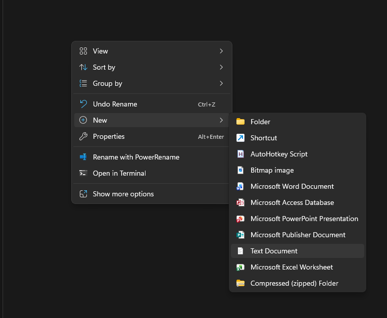
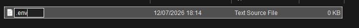
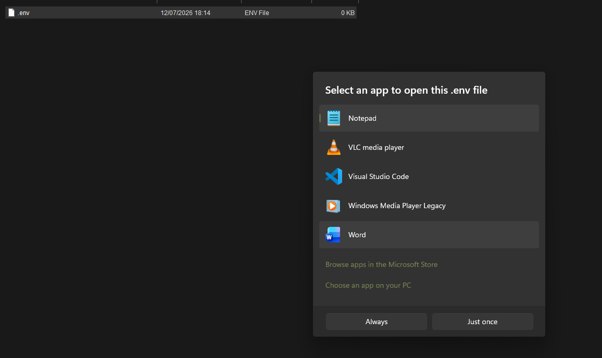
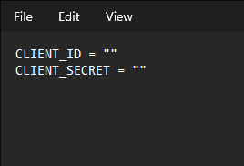

PyOSS has core fundimentals such as:
1. A login / logout system
2. A user-specific file system
3. Mini Games
4. WIP: School Supplies
5. Actual system specs (of your PC)
6. Others: Music, Calculator and Notes.

**MENTIONS**
- The notes system does NOT save to the PyOSS file system and is currently broken (12/07/26)
- currently buggy. Not tested on other machines

**MUSIC**
- You need to have spotify open
- Your spotify account must be **PREMIUM**
- You are have to create your own .env with two variables: 1. CLIENT_ID and 2. CLIENT_SECRET
- Below is a video on how to setup spotify for this "Operating System"
[VIDEO](https://www.youtube.com/watch?v=ox5T9BpJRbc)

**CREATING .env FILE**

**RUNNING THE PROGRAM**
1. Make sure you have python installed
2. Create a virtual Enviroment inside your project folder
3. Install requirements

**Step 1:**
Install Python:
- [INSTALL PYTHON ON WINDOWS 11](https://www.youtube.com/watch?v=e70ykVBazAg)
- [INSTALL PYTHON ON UBUNTU/DEBAIN](https://www.youtube.com/watch?v=E06o4MGTd7g)
- [INSTALL PYTHON ON MAC OS](https://www.youtube.com/watch?v=utVZYVJSTZA)

**Step 2:**
To create a **virtual enviroment**, run this command in your project folder (inside Powershell / bash)

**python -m venv venv**

**Step 3:**
Run the command below:
- pip install -r requirements.txt (Must be in your project folder)